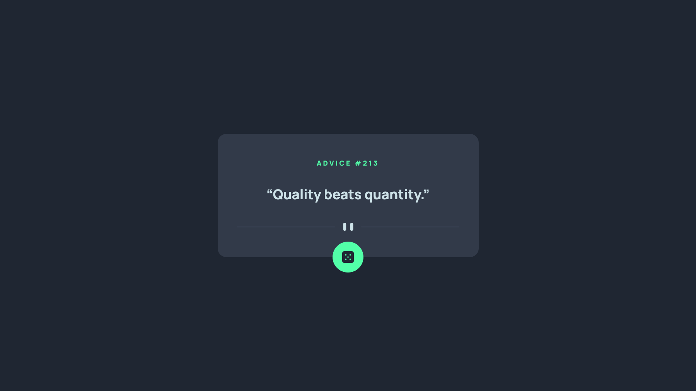
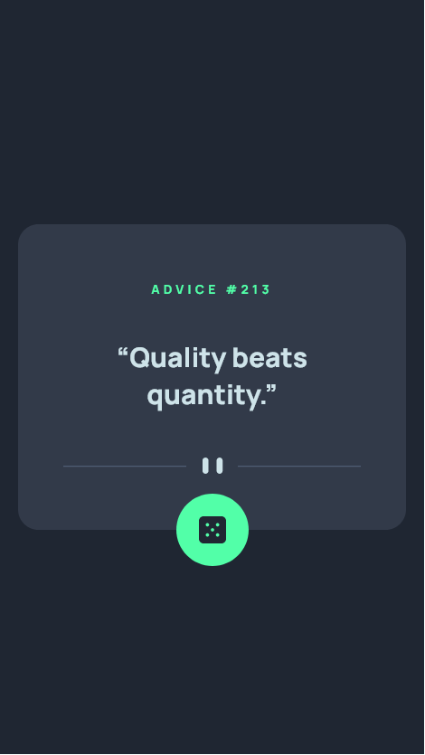

# Frontend Mentor - Advice generator app solution

This is a solution to the [Advice generator app challenge on Frontend Mentor](https://www.frontendmentor.io/challenges/advice-generator-app-QdUG-13db). Frontend Mentor challenges help you improve your coding skills by building realistic projects.

## Table of contents

- [Overview](#overview)
  - [The challenge](#the-challenge)
  - [Screenshot](#screenshot)
  - [Links](#links)
- [My process](#my-process)
  - [Built with](#built-with)
  - [Continued development](#continued-development)
- [Author](#author)

## Overview

You can click on the dice button and everytime you click on it, it will fetch a new advice for you.

### The challenge

Users should be able to:

- Click on dice button which will update the Advice.

### Screenshot

Laptop Screen

Mobile Screen

### Links

- Solution URL: [Github Repo](https://github.com/roshgupta/Advice-generator-app)
- Live Site URL: [View page on Github Pages](https://roshgupta.github.io/Advice-generator-app/)

## My process

### Built with

- Semantic HTML5 markup
- CSS custom properties
- Flexbox
- Desktop-first workflow

### Continued development

Currently i am learning DSA and doing some web developement projects.

## Author

- Frontend Mentor - [@roshgupta](https://www.frontendmentor.io/profile/roshgupta)
- Twitter - [@0roshan\_\_gupta](https://twitter.com/0roshan__gupta)
